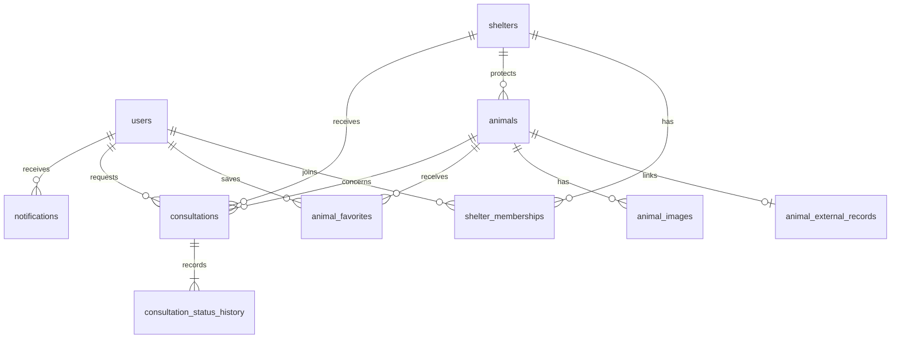

# PetEver 테이블 설계 v1

## Supabase 적용 결과 — 2026-09-15 (shelter_id nullable, 실행 대기)

`docs/superpowers/specs/2026-09-15-animal-listing-types-design.md` 2절 결정에 따라
분실 신고 동물은 가짜 placeholder 보호소 대신 `shelter_id NULL`로 표현하도록
코드를 바꿨다. 이 세션에는 Supabase 접속 정보(`DB_URL`/`DB_PASSWORD` 등)가 없어
아래 DDL을 실제로 실행하지 못했다 — **이미 운영 중인 스키마를 바꾸는 작업이므로
Supabase 자격 증명을 가진 사람이 SQL Editor에서 직접 확인 후 실행해야 한다.**

**배포 순서 — 반드시 지킨다: 아래 DDL/정리 SQL을 먼저 실행하고, 그 다음 이 커밋의
백엔드 코드를 배포한다.** 순서가 바뀌면(코드가 먼저 배포되면) 새 코드는 분실 신고마다
`shelter_id = NULL`을 쓰려 하는데 컬럼이 아직 NOT NULL이라 매 건 INSERT가 거부되고,
`sync_runs`에는 원인을 알 수 없는 `"One or more records could not be imported"`만
남아 분실 신고 수집이 조용히 전멸한다.

1. **사전 확인** (정리 대상이 있는지 파악):
   ```sql
   SELECT count(*) FROM animal_images WHERE source = 'LOSS_INFO';
   SELECT a.id FROM animals a JOIN shelters s ON s.id = a.shelter_id
    WHERE s.external_source = 'SYSTEM' AND s.external_id = 'LOSS_INFO_PLACEHOLDER';
   ```
2. **DDL과 정리를 하나의 트랜잭션으로 실행**:
   ```sql
   BEGIN;
   ALTER TABLE animals ALTER COLUMN shelter_id DROP NOT NULL;
   UPDATE animals a SET shelter_id = NULL FROM shelters s
     WHERE a.shelter_id = s.id AND s.external_source = 'SYSTEM' AND s.external_id = 'LOSS_INFO_PLACEHOLDER';
   -- animal_images.source는 이제 "누가 올렸나"만 구분한다(5절 참고) — 기존 분실 신고
   -- 사진 행을 PUBLIC_API로 정리한다. animal_images.source에 CHECK 제약이 걸려 있다면
   -- 이 UPDATE가 거부되는지 여기서 확인한다(걸려 있었다면 애초에 LOSS_INFO 값의 INSERT가
   -- 거부됐을 것이므로 정리할 행이 없을 수 있다).
   UPDATE animal_images SET source = 'PUBLIC_API' WHERE source = 'LOSS_INFO';
   DELETE FROM shelters WHERE external_source = 'SYSTEM' AND external_id = 'LOSS_INFO_PLACEHOLDER';
   COMMIT;
   ```
3. 위 트랜잭션 실행 후에만 코드를 배포한다.

실행 후 이 문단은 12개 테이블 최초 적용 기록처럼 "적용 완료"로 갱신한다.

## Supabase 적용 결과 — 2026-09-12

사용자 요청에 따라 기존 Supabase `petever` 프로젝트(`jraihqgetttetqosvlvo`)의 public 스키마에 핵심 12개 테이블을 생성했다. 아래 본문의 MySQL 자료형은 최초 논리 설계이며, 현재 실제 DB 엔진은 PostgreSQL이다.

- BIGINT 자동 증가는 GENERATED BY DEFAULT AS IDENTITY, DATETIME(6)은 timestamptz, JSON은 jsonb, 이벤트 ID는 uuid로 변환했다.
- 상담 중복 방지는 생성 컬럼 대신 REQUESTED / APPROVED 행에만 적용되는 부분 유니크 인덱스 `consultations_one_active`로 구현했다.
- 변경 가능한 10개 테이블에 updated_at 자동 갱신 트리거를 설정했다.
- 12개 테이블 모두 RLS를 활성화하고 anon / authenticated의 테이블·시퀀스 권한을 회수했다. React 직접 접근을 열지 않았으며 Spring Boot 연결과 애플리케이션 권한 검사는 추후 구현한다. 기존 Supabase Auth 계정과 public.users는 자동 연동되지 않는다.
- DB 메타데이터 조회로 테이블 12개, 외래키 19개, RLS 활성화 12개, 브라우저 역할 테이블 권한 0개, 부분 유니크 인덱스와 트리거 10개를 확인했다. 실제 API 수집 및 서비스 동작 테스트는 아직 수행하지 않았다.
- 실행 SQL은 Supabase SQL snippet `PetEver initial schema 2026-09-12 (already applied)`로 보관했다. 이미 적용한 초기 생성 SQL이므로 다시 실행하지 않는다.
- Kafka용 outbox_events는 설계대로 후속 단계에 추가한다. 데이터는 아직 수집하지 않았다.

## 범위와 전제

Spring Boot + React + MySQL 기반의 1인 프로젝트다. 공공 API 동물 수집, 보호소 직접 등록, 관심 동물, 입양 상담, 병원 안내를 지원한다. 이 문서는 논리 설계이며 실제 DB를 생성하거나 마이그레이션을 실행하지 않는다.

- PK는 BIGINT 자동 증가를 기본으로 한다. 시간은 DATETIME(6)에 UTC로 저장하고 화면에서 한국 시간으로 표시한다.
- 필수 여부가 표시되지 않은 컬럼은 NOT NULL이다. 모든 테이블에 created_at을 두고, 변경 가능한 테이블에는 updated_at을 둔다.
- 상태는 VARCHAR 코드로 저장하고 애플리케이션 enum 및 DB CHECK로 허용 값을 제한한다. 실제 DDL 작성 시 MySQL 버전을 확정한다.
- 일반 회원이 보호소 소속 승인을 받으면 담당자 권한을 얻는다. 관리자는 users.system_role로 구분한다.
- 첫 버전은 상담 일정의 자유 입력을 사용한다. 시간대 예약, 채팅, 병원 예약은 포함하지 않는다.
- 실제 공공 API 응답을 확인하기 전이므로 외부 필드명과 상태 코드 매핑은 구현 전에 확정한다. 내부 설계 이름을 공공 API 필드명으로 간주하지 않는다.

## 관계 요약



병원 안내용 veterinary_clinics와 수집 실행 기록용 sync_runs는 독립 테이블이다. Redis와 Kafka는 MySQL 테이블을 대체하지 않는다.

## 1. users — 회원

| 컬럼 | 타입 | 의미 |
|---|---|---|
| id | BIGINT PK | 회원 식별자 |
| email | VARCHAR(254) UNIQUE | 로그인 이메일, 공백 제거·정규화 후 저장 |
| password_hash | VARCHAR(255) | 비밀번호 해시 |
| nickname | VARCHAR(50) | 표시 이름 |
| phone | VARCHAR(30), NULL | 연락처 |
| system_role | VARCHAR(20) | USER / ADMIN |
| status | VARCHAR(20) | ACTIVE / SUSPENDED / WITHDRAWN |

보호소 담당자 여부는 이 테이블의 역할 값으로 중복 관리하지 않고 승인된 소속 관계로 판단한다. 탈퇴 시 개인정보 삭제·익명화와 상담 이력 보존 정책을 별도로 적용하며 연관 데이터를 무조건 연쇄 삭제하지 않는다.

## 2. shelters — 보호소

| 컬럼 | 타입 | 의미 |
|---|---|---|
| id | BIGINT PK | 내부 보호소 식별자 |
| external_source | VARCHAR(30), NULL | 공공 데이터 제공처 |
| external_id | VARCHAR(100), NULL | 제공처의 보호소 식별자 |
| name | VARCHAR(150) | 보호소명 |
| phone | VARCHAR(30), NULL | 대표 연락처 |
| address | VARCHAR(500), NULL | 주소 |
| region_code | VARCHAR(20), NULL | 지역 코드 |
| latitude / longitude | DECIMAL(10,7), NULL | 위치 |
| inquiry_guide | TEXT, NULL | 담당자가 입력한 문의 안내 |
| participation_status | VARCHAR(20) | UNREGISTERED / ACTIVE / SUSPENDED |
| last_synced_at | DATETIME(6), NULL | 공공 정보 최종 갱신 시각 |

UNIQUE(external_source, external_id). 외부 출처와 외부 ID는 함께 존재하거나 함께 NULL이어야 한다. 이름이 같다는 이유로 보호소를 합치지 않는다. 공공 데이터 수집만으로 참여 상태를 ACTIVE로 바꾸지 않는다. 연락처 등 공공 기본 정보는 수집으로 갱신하고, inquiry_guide와 참여 상태는 덮어쓰지 않는다.

## 3. shelter_memberships — 담당자 소속 및 승인

| 컬럼 | 타입 | 의미 |
|---|---|---|
| id | BIGINT PK | 소속 관계 식별자 |
| user_id | BIGINT FK → users | 신청 회원 |
| shelter_id | BIGINT FK → shelters | 소속 보호소 |
| status | VARCHAR(20) | PENDING / APPROVED / REJECTED / REVOKED |
| application_note | TEXT, NULL | 소속 확인을 위한 신청 내용 |
| reviewed_by | BIGINT FK → users, NULL | 검토 관리자 |
| reviewed_at | DATETIME(6), NULL | 검토 시각 |
| review_reason | VARCHAR(1000), NULL | 거절·회수 사유 |

UNIQUE(user_id, shelter_id). 한 회원이 여러 보호소에 소속될 수 있다. 초기 버전은 보호소 내부 직급을 나누지 않는다. 승인된 소속과 ACTIVE 보호소를 모두 확인해 등록·수정·상담 처리 권한을 부여한다.

## 4. animals — 서비스에서 사용하는 동물 정보

| 컬럼 | 타입 | 의미 |
|---|---|---|
| id | BIGINT PK | 찜·상담에서 참조하는 고정 식별자 |
| shelter_id | BIGINT FK → shelters, NULL 허용 | 현재 보호소; 분실 신고처럼 보호소가 없는 리스팅은 NULL |
| origin | VARCHAR(20) | PUBLIC_API / SHELTER; 최초 등록 경로 |
| created_by | BIGINT FK → users, NULL | 직접 등록한 담당자 |
| name | VARCHAR(100), NULL | 담당자가 지은 이름 |
| species | VARCHAR(20) | DOG / CAT / OTHER / UNKNOWN |
| breed_name | VARCHAR(100), NULL | 품종 표시명 |
| sex | VARCHAR(10) | MALE / FEMALE / UNKNOWN |
| neuter_status | VARCHAR(10) | YES / NO / UNKNOWN |
| age_description | VARCHAR(100), NULL | 추정 나이 또는 출생연도 원문 |
| weight_kg | DECIMAL(6,2), NULL | 체중, 양수만 허용 |
| color | VARCHAR(100), NULL | 색상 |
| found_date | DATE, NULL | 발견 일자 |
| found_place | VARCHAR(500), NULL | 발견 장소 |
| description | TEXT, NULL | 담당자가 작성하는 소개 |
| care_status | VARCHAR(30) | PROTECTED / ADOPTED / RETURNED / TRANSFERRED / DECEASED / OTHER_CLOSED / UNKNOWN |
| status_authority | VARCHAR(20) | PUBLIC_API / SHELTER; 보호 상태의 갱신 주체 |
| visibility | VARCHAR(20) | PUBLIC / HIDDEN |
| consultation_enabled | BOOLEAN | 담당자가 설정한 상담 접수 여부; 기본 false |

origin과 status_authority를 분리한다. 직접 등록한 동물을 공공 기록과 연결하더라도 최초 등록 경로는 바뀌지 않는다. 공공 연결 후 종류·품종·성별·발견 정보 등 기본 정보는 공공 기록으로 갱신하고, name·description·visibility·consultation_enabled와 담당자 사진은 보존한다. 연결 시 이 규칙을 담당자에게 알린다.

`shelter_id`가 NULL인 동물은 보호소가 없는 리스팅(현재는 분실 신고)이다. 상담 신청 조건(아래 문단)이 원래도 `shelters` JOIN 기반이므로 이런 행은 별도 예외 처리 없이 자연히 상담 대상에서 빠진다.

분실 신고는 정밀 위치 정보가 없어 `found_place`에 지자체명(`orgNm`)을 넣는다 — 구조동물 공고의 `found_place`(정밀 발견 장소)와 정밀도가 다르므로 화면에서 혼동하지 않게 표시한다.

보호 상태는 status_authority가 지정한 주체만 갱신한다. API 동물은 PUBLIC_API, 직접 등록 동물은 SHELTER가 기본이다. 확인된 담당자가 관리 권한을 인수하면 SHELTER로 변경해 입양 완료가 오래된 API 상태로 되돌아가지 않게 한다. 외부 상태는 별도 기록에 계속 보존한다.

상담 신청은 공개 동물, PROTECTED 상태, consultation_enabled=true, ACTIVE 보호소, 승인된 담당자 존재 조건을 모두 만족해야 한다. 외부 상태와 담당자 상태가 충돌하면 담당자가 확인할 수 있도록 표시하며 조용히 덮어쓰지 않는다.

## 5. animal_external_records — 공공 데이터 연결 및 원본

| 컬럼 | 타입 | 의미 |
|---|---|---|
| id | BIGINT PK | 외부 기록 식별자 |
| animal_id | BIGINT FK → animals, UNIQUE | 연결된 내부 동물 |
| source | VARCHAR(30) | 제공처 코드 |
| external_id | VARCHAR(100) | 공공 데이터의 안정적인 동물 식별자 |
| notice_number | VARCHAR(100), NULL | 공고번호; 동물 식별자와 구분 |
| notice_start_date / notice_end_date | DATE, NULL | 공고 기간 |
| external_status | VARCHAR(100), NULL | 외부 상태 원문 |
| raw_payload | JSON | 최근 정상 응답 원본 |
| source_updated_at | DATETIME(6), NULL | 원본이 제공하는 수정 시각 |
| last_seen_at | DATETIME(6) | 마지막 정상 조회 시각 |
| last_synced_at | DATETIME(6) | 마지막 반영 시각 |

`source` 허용값:

| 값 | 의미 | 비고 |
|---|---|---|
| ANIMAL_API | 구조동물(유기동물) 공고 조회 서비스 — 보호소가 보호 중, 입양 상담 가능 | 이름은 도입 당시 "공공 API 전체"를 뜻했으나 지금은 이 소스 하나만 가리킨다. 운영 데이터 마이그레이션 비용 대비 이점이 작아 개명은 보류했다 |
| LOSS_INFO | 분실 신고 조회 서비스 — 주인이 신고한 실종 반려동물, 입양 상담 불가 | 고유 식별자·보호소·공고 기간 없음; 식별자는 SHA-256 근사 해시(아래) |

목록/상세 API 응답의 `listingType`은 이 컬럼 값으로 런타임에 추론한다(`LOSS_INFO`면 `LOST_REPORT`, 아니면 `SHELTER_ANIMAL`) — 새 소스를 추가하면 `AnimalController`와 `AnimalRepository.findPublic`의 이 매핑도 함께 갱신해야 한다.

이 컬럼은 응답 페이로드의 모양(`desertionNo` 유무)으로 결정되는 반면, `sync_runs.source`는 어떤 클라이언트로 호출했는지로 결정된다 — 정상 동작 시 둘은 항상 일치하지만, 엔드포인트가 잘못 설정돼 한 소스의 URL이 다른 소스의 응답을 반환하면 두 값이 어긋날 수 있다(그 경우 여전히 `animal_external_records.source`가 실제 데이터 모양을 따르므로 표시상 오류는 없다).

분실 신고는 공식 접수번호 같은 안정적 식별자 필드가 없어(이번 세션에는 실제 API 응답을 확인할 키가 없어 재확인하지 못했다) `external_id`를 신고일·지자체·품종·성별·색상 해시로 근사한다. 같은 날 같은 지역에 같은 품종·성별·색상 분실 신고가 2건 이상이면 서로 다른 신고가 같은 식별자로 충돌할 수 있다 — 알려진 제약으로 남겨둔다.

UNIQUE(source, external_id)로 중복 수집을 막는다. v1은 동물 하나당 외부 기록 하나를 허용한다. API 검색 결과에서 사라졌다는 이유로 동물을 삭제하거나 입양 완료 처리하지 않는다.

직접 등록 동물 연결 시 식별번호로 기존 수집 기록을 찾는다. 이미 다른 animals에 연결돼 있으면 일반 연결을 거절하고 관리자 병합으로 처리한다. 병합은 직접 등록 동물 ID를 유지하고 상담·사진·찜 참조를 이동하며 중복 찜을 해소한 뒤 외부 기록을 연결하는 하나의 트랜잭션으로 수행한다. 서로 다른 보호소 소속이면 자동 병합하지 않는다.

## 6. animal_images — 동물 사진

| 컬럼 | 타입 | 의미 |
|---|---|---|
| id | BIGINT PK | 사진 식별자 |
| animal_id | BIGINT FK → animals | 동물 |
| source | VARCHAR(20) | PUBLIC_API / SHELTER |
| url | VARCHAR(2048) | 조회 가능한 이미지 주소 |
| storage_key | VARCHAR(500), NULL | 직접 업로드한 파일의 저장소 키 |
| uploaded_by | BIGINT FK → users, NULL | 업로드 담당자 |
| sort_order | INT | 표시 순서, 0 이상 |

이미지 파일 자체는 DB에 저장하지 않는다. 정렬 순서와 id가 가장 앞선 사진을 대표 사진으로 사용한다. API 갱신 시 PUBLIC_API 사진만 동기화하며 담당자 사진은 유지한다. `source`는 "누가 올렸나"만 구분한다 — 구조동물 공고든 분실 신고든 공공 API로 들어온 사진은 모두 PUBLIC_API이며, 어떤 공공 API인지는 `animal_external_records.source`로만 구분한다.

## 7. animal_favorites — 관심 동물

| 컬럼 | 타입 | 의미 |
|---|---|---|
| id | BIGINT PK | 관심 등록 식별자 |
| user_id | BIGINT FK → users | 회원 |
| animal_id | BIGINT FK → animals | 관심 동물 |

UNIQUE(user_id, animal_id). 찜 해제는 해당 행을 삭제한다. 관심 동물이 입양 완료돼도 관심 목록에서는 유지한다.

## 8. consultations — 입양 상담 신청

| 컬럼 | 타입 | 의미 |
|---|---|---|
| id | BIGINT PK | 상담 식별자 |
| applicant_id | BIGINT FK → users | 신청자 |
| animal_id | BIGINT FK → animals | 상담 대상 동물 |
| shelter_id | BIGINT FK → shelters | 신청 당시 접수 보호소 |
| applicant_name | VARCHAR(100) | 신청 시 이름 |
| contact_phone | VARCHAR(30) | 신청 시 연락처 |
| application_message | TEXT | 신청 내용 |
| preferred_schedule | VARCHAR(500), NULL | 희망 상담 일정 |
| scheduled_at | DATETIME(6), NULL | 확정 상담 시각 |
| status | VARCHAR(20) | REQUESTED / APPROVED / REJECTED / CANCELLED / COMPLETED |
| handled_by | BIGINT FK → users, NULL | 처리 담당자 |
| decision_reason | VARCHAR(1000), NULL | 거절 등 처리 사유 |
| result_note | TEXT, NULL | 상담 결과, 담당자 전용 |
| version | BIGINT | 낙관적 잠금용, 기본 0 |

신청 당시 연락처와 접수 보호소를 보존한다. 동물의 보호소가 바뀌어도 과거 상담의 접근 권한이 새 보호소에 자동으로 넘어가지 않는다. 기존 진행 상담은 이전 보호소가 취소 처리하고 사용자가 새 보호소에 재신청하는 정책을 사용한다.

허용 전이: REQUESTED → APPROVED / REJECTED / CANCELLED, APPROVED → COMPLETED / CANCELLED. COMPLETED는 상담 완료이며 입양 확정이 아니다. 입양 완료는 동물 보호 상태 변경으로 별도 처리한다. 거절·담당자 취소에는 사유를 요구한다.

같은 회원·동물에 REQUESTED 또는 APPROVED 상담은 하나만 허용한다. DDL에서 해당 상태일 때 1, 나머지는 NULL인 생성 컬럼 active_marker를 두고 UNIQUE(applicant_id, animal_id, active_marker)로 동시 신청도 차단한다. 상태 변경은 version 검사와 이력 저장을 같은 트랜잭션으로 수행한다.

## 9. consultation_status_history — 상담 상태 변경 이력

| 컬럼 | 타입 | 의미 |
|---|---|---|
| id | BIGINT PK | 이력 식별자 |
| consultation_id | BIGINT FK → consultations | 상담 |
| from_status | VARCHAR(20), NULL | 이전 상태, 최초 신청이면 NULL |
| to_status | VARCHAR(20) | 새 상태 |
| changed_by | BIGINT FK → users, NULL | 변경 회원, 시스템 처리면 NULL |
| reason | VARCHAR(1000), NULL | 처리 사유 |

최초 신청도 기록하며 이력은 추가만 한다. 최신 상태는 consultations에 보관해 목록 조회 때 매번 이력을 집계하지 않는다.

## 10. veterinary_clinics — 동물병원 안내

| 컬럼 | 타입 | 의미 |
|---|---|---|
| id | BIGINT PK | 병원 식별자 |
| external_source / external_id | VARCHAR(100), NULL | 데이터 제공처와 외부 식별자 |
| name | VARCHAR(150) | 병원명 |
| phone | VARCHAR(30), NULL | 전화번호 |
| address | VARCHAR(500) | 주소 |
| region_code | VARCHAR(20), NULL | 지역 코드 |
| latitude / longitude | DECIMAL(10,7), NULL | 위치 |
| website_url | VARCHAR(2048), NULL | 홈페이지 |
| operating_status | VARCHAR(20) | OPEN / CLOSED / UNKNOWN |
| last_verified_at | DATETIME(6), NULL | 마지막 정보 확인 시각 |

UNIQUE(external_source, external_id). 외부 출처와 식별자는 함께 존재하거나 함께 NULL이다. 병원 데이터 제공처는 별도로 선정한다. 홈페이지와 전화번호가 없는 데이터도 허용하며, 영업 상태는 현재 시각에 진료 중이라는 뜻이 아니다. 병원 계정·문의·예약 테이블은 만들지 않는다.

## 11. notifications — 사용자 알림

| 컬럼 | 타입 | 의미 |
|---|---|---|
| id | BIGINT PK | 알림 식별자 |
| recipient_id | BIGINT FK → users | 수신 회원 |
| event_id | CHAR(36) | 원인 이벤트 식별자 |
| type | VARCHAR(40) | CONSULTATION_REQUESTED / CONSULTATION_STATUS_CHANGED / FAVORITE_ANIMAL_STATUS_CHANGED |
| animal_id | BIGINT FK → animals, NULL | 관련 동물 |
| consultation_id | BIGINT FK → consultations, NULL | 관련 상담 |
| title | VARCHAR(200) | 제목 |
| message | VARCHAR(1000) | 본문 |
| read_at | DATETIME(6), NULL | 읽은 시각 |

UNIQUE(recipient_id, event_id). 동일 이벤트 재처리 시 알림이 중복 생성되지 않는다. event_id는 재시도 때 새로 생성하지 않는다. 첫 버전은 서비스 내 알림을 사용한다.

## 12. sync_runs — 공공 데이터 수집 실행 기록

| 컬럼 | 타입 | 의미 |
|---|---|---|
| id | BIGINT PK | 실행 식별자 |
| source | VARCHAR(100) | 수집 대상 |
| status | VARCHAR(20) | RUNNING / SUCCEEDED / FAILED / PARTIAL |
| request_scope | JSON | 기간·지역 등 수집 조건 |
| started_at | DATETIME(6) | 시작 |
| finished_at | DATETIME(6), NULL | 종료 |
| last_successful_page | INT, NULL | 마지막 성공 페이지; 진단용 |
| fetched_count / inserted_count / updated_count / failed_count | INT | 각 처리 건수, 기본 0 |
| error_summary | TEXT, NULL | 인증키 등 비밀값을 제거한 오류 요약 |

수집 실패는 별도로 기록하고 기존 서비스 데이터는 유지한다. 페이지가 수집 도중 바뀔 수 있으므로 재시작 시 마지막 페이지 번호만 신뢰하지 않고 겹치는 범위를 다시 조회한다. 외부 식별자 기반 갱신으로 재처리를 안전하게 만든다.

## 주요 조회 인덱스

PK와 UNIQUE 이외에 아래를 우선 적용하고 실제 실행 계획에 따라 조정한다. 모든 필터 조합에 인덱스를 미리 만들지는 않는다.

| 테이블 | 인덱스 | 용도 |
|---|---|---|
| shelter_memberships | (shelter_id, status, user_id) | 승인 담당자 확인 |
| shelters | (region_code, id) | 지역 보호소 조회 |
| animals | (visibility, care_status, created_at, id) | 공개 동물 최신 목록 |
| animals | (shelter_id, visibility, care_status, id) | 보호소별 동물 |
| animals | (species, visibility, care_status, created_at, id) | 종류별 목록 |
| animal_images | (animal_id, sort_order, id) | 사진 정렬 |
| animal_favorites | (user_id, created_at, id), (animal_id, user_id) | 내 목록·알림 수신자 |
| consultations | (applicant_id, created_at, id) | 내 상담 |
| consultations | (shelter_id, status, created_at, id) | 담당자 상담함 |
| consultation_status_history | (consultation_id, created_at, id) | 상담 이력 |
| veterinary_clinics | (region_code, operating_status, id) | 지역 병원 안내 |
| notifications | (recipient_id, read_at, created_at, id) | 미확인 알림 |
| sync_runs | (source, started_at, id) | 최근 수집 결과 |

FK 컬럼의 인덱스도 DDL에서 확인한다. 동물 지역 필터는 shelters와 JOIN하며 지역명을 animals에 중복 저장하지 않는다. 초기 품종은 문자열로 저장하고 표준 품종 코드 테이블은 실제 API 코드 확인 후 필요할 때 도입한다.

## Kafka 도입 시 추가: outbox_events

초기 핵심 12개 테이블에는 포함하지 않는다. Kafka 알림을 도입할 때 DB 저장 성공과 이벤트 발행 사이의 유실을 막기 위해 추가한다.

| 컬럼 | 타입 | 의미 |
|---|---|---|
| id | CHAR(36) PK | 재시도에도 유지되는 이벤트 ID |
| aggregate_type | VARCHAR(30) | ANIMAL / CONSULTATION |
| aggregate_id | BIGINT | 대상 식별자; 여러 유형이므로 단일 FK 없음 |
| event_type | VARCHAR(50) | 이벤트 종류 |
| payload | JSON | 발행할 최소 데이터 |
| status | VARCHAR(20) | PENDING / PROCESSING / PUBLISHED / FAILED |
| attempt_count | INT | 시도 횟수 |
| next_attempt_at | DATETIME(6) | 다음 시도 시각 |
| locked_until | DATETIME(6), NULL | 처리 점유 만료 시각 |
| published_at | DATETIME(6), NULL | 발행 완료 시각 |
| last_error | TEXT, NULL | 최근 오류 |

업무 데이터 변경과 outbox 저장을 하나의 DB 트랜잭션으로 처리한다. 발행기는 성공 응답 후 PUBLISHED로 변경하며, 장애 시 같은 ID로 재발행할 수 있다. 수신자는 notifications의 유니크 제약으로 중복을 제거한다. 같은 동물·상담 이벤트는 같은 Kafka 키로 전달한다. 민감한 상담 내용과 전화번호를 이벤트에 복제하지 않는다.

## 구현 순서 및 검증 기준

1. users, shelters, shelter_memberships: 승인받지 않은 회원과 다른 보호소 담당자의 수정 요청이 거부된다.
2. animals, animal_external_records, animal_images, sync_runs: 반복 수집이 중복을 만들지 않고 담당자 소개·사진을 보존한다. 수집 실패로 기존 동물이 삭제되지 않는다.
3. animal_favorites: 동시 찜 요청에도 한 행만 존재한다.
4. consultations, consultation_status_history: 동시 상담 신청, 승인·취소 충돌, 다른 보호소 접근을 차단하고 이력과 현재 상태가 일치한다.
5. veterinary_clinics, notifications: 누락 연락처 표시와 동일 이벤트 재처리를 검증한다.
6. Redis 적용 후 목록 캐시 갱신과 성능을 비교한다. Kafka 도입 시 outbox_events를 추가해 발행 실패·중복 전달을 검증한다.

설계 결정: 첫 버전에서는 별도 입양 계약·입양자 개인정보 테이블을 만들지 않는다. 상담 완료와 동물 입양 상태를 구분하며, 공식 입양 절차 자체는 보호소가 수행한다.
